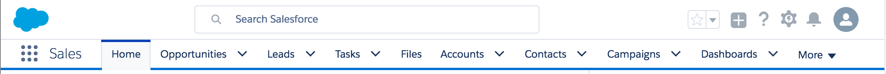

[&lt; Retour au sommaire](../README.md)

# Avant de commencer (~ 10 min)
[Lien Trailhead](https://trailhead.salesforce.com/fr/modules/lex_dev_lc_basics/units/lex_dev_lc_basics_prereqs)

## Attention cher pionnier !
Salesforce offre deux types d’interface utilisateur : Lightning Experience (nouvelle) et Salesforce Classic (ancienne). Ce module est conçu pour Lightning Experience.

Assurez vous que votre interface ressemble à ceci:

Si ce n'est pas le cas, vous pouvez basculer vers la nouvelle interface en cliquant sur votre nom en haut à droite de l'écran puis sur **Basculer vers Lightning Experience**.

## Objectifs de formation
Une fois cette unité terminée, vous pourrez :
- Configurer Mon domaine pour votre organisation Developer Edition.
- Créer 2 objets personnalisés requis pour l'exercise.

## Ajout d’un domaine personnalisé à votre organisation avec Mon Domaine
Pour utiliser les composants Lightning, votre organisation doit avoir un nom de domaine personnalisé configuré à l’aide de Mon domaine.
Une fois votre domaine personnalisé défini, vous utiliserez Salesforce à l’adresse `https://votreDomaine-dev-ed.my.salesforce.com`.

Au dela de la personalisation de l'URL d'accès, cela est nécessaire pour des raisons de sécurité comme la prévention de vulnérabilités XSS (Cross-Site Scripting).

Utilisez l’assistant Mon domaine pour créer un sous-domaine.

1. Dans Configuration, saisissez "domaine" dans le champ *Recherche rapide*, puis sélectionnez **Mon domaine**.
2. Saisissez le nom de votre sous-domaine après *https://*, puis cliquez sur **Vérifier la disponibilité**. Généralement, un sous-domaine correspond au nom de votre société, mais vous pouvez utiliser n’importe quel nom, à condition qu’il soit unique. Si ce nom est déjà utilisé, choisissez-en un autre.
3. Cliquez sur **Enregistrer le domaine**.

Salesforce met à jour ses registres de domaines en ajoutant votre nouveau sous-domaine. Une fois l’opération terminée, vous recevez un e-mail avec un objet de type « Votre domaine Developer Edition est prêt pour le test ». L’opération prend quelques minutes seulement.

## Déploiement de Mon domaine dans votre organisation
Une fois l'e-mail d'activation reçu, effectuez les actions suivantes:

1. Cliquez sur le lien de l’e-mail d’activation pour vous connecter à votre sous-domaine Salesforce. Vous serez dirigé vers votre organisation Salesforce. Examinez l’URL dans la barre d’adresse de votre navigateur, elle inclut le nom de votre nouveau sous-domaine. A ce stade seul vous - l'administrateur - y avez accés.
2. Cliquez sur **Déployer vers des utilisateurs**, puis sur **OK**. Le déploiement d’un sous-domaine autorise l'accés à la nouvelle URL à l’ensemble de votre organisation. Tous vos utilisateurs peuvent désormais l'utiliser.
3. Cliquez sur **OK**.
4. L’étape 4 de l’assistant affiche les options de configuration, que vous pouvez ignorer pour le moment.

## Définition de l’objet personnalisé Expense
Dans le cadre de l'exercise, nous aurons besoin de créer des objects personnalisés (l'équivalent d'une table dans une base de données).

Voici les instructions pour créer un premier objet "Expense" et ses champs:

<ol>
<li>Dans Configuration, entrez "object" dans le champ <i>Recherche rapide</i>, puis sélectionnez <b>Gestionnaire d’objet</b>.</li>
<li>Sélectionnez <b>Créer | Objet personnalisé</b>.</li>
<li>Entrez les valeurs suivantes pour la définition de l’objet:

<table>
  <thead>
    <tr>
      <th>Champ</th><th>Valeur</th>
    </tr>
  </thead>
  <tbody>
    <tr>
      <td>Étiquette</td><td>Expense</td>
    </tr>
    <tr>
      <td>Étiquette au pluriel</td><td>Expenses</td>
    </tr>
    <tr>
      <td>Commence par une voyelle</td><td>coché</td>
    </tr>
    <tr>
      <td>Nom de l’API</td><td>Expense__c</td>
    </tr>
  </tbody>
</table>

Acceptez les valeurs par défaut pour le reste de la définition de l’objet.</li>

<li>Faites défiler jusqu’à la section <i>Champs &amp; relations</i> de la page des détails de l’objet. Pour chacun des champs suivants, cliquez sur <b>Nouveau</b> et définissez le champ avec les détails suivants:

<table>
  <thead>
    <tr>
      <th>Étiquette de champ</th><th>Nom de l’API</th><th>Type du champ</th>
    </tr>
  </thead>
  <tbody>
    <tr>
      <td>Montant</td><td>Amount__c</td><td>Numéro(16,2)</td>
    </tr>
    <tr>
      <td>Client</td><td>Client__c</td><td>Texte(50)</td>
    </tr>
    <tr>
      <td>Date</td><td>Date__c</td><td>Date</td>
    </tr>
    <tr>
      <td>Remboursé</td><td>Reimbursed__c</td><td>Case à cocher</td>
    </tr>
  </tbody>
</table>
</li>
</ol>

## Définition de l’objet personnalisé Camping Item
Créez un second objet personalisé nommé "Camping Item" avec les champs suivants:
<table>
  <thead>
    <tr>
      <th>Étiquette de champ</th><th>Nom de l’API</th><th>Type du champ</th><th>Commentaire</th>
    </tr>
  </thead>
  <tbody>
    <tr>
      <td>Quantity</td><td>Quantity__c</td><td>Numéro(18, 0)</td><td>Obligatoire</td>
    </tr>
    <tr>
      <td>Price</td><td>Price__c</td><td>Devise(16, 2)</td><td>Obligatoire</td>
    </tr>
    <tr>
      <td>Packed</td><td>Packed__c</td><td>Case à cocher</td><td>Non cochée</td>
    </tr>
  </tbody>
</table>

## Défi pratique
Validez votre travail automatiquement grâce au [Défi Trailhead](https://trailhead.salesforce.com/fr/modules/lex_dev_lc_basics/units/lex_dev_lc_basics_prereqs#challenge).

---
[&lt; Retour au sommaire](../README.md)
[&gt; Unité suivante](02.md)
