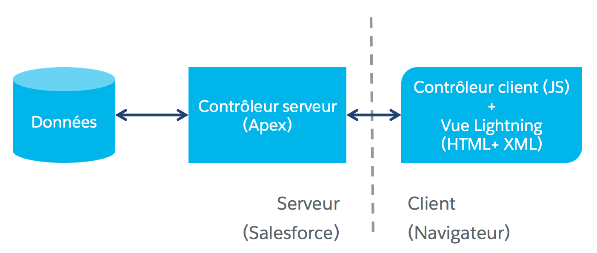

[&lt; Retour au sommaire](../README.md)

# Premiers pas avec les composants Lightning (~ 15 min)
[Lien Trailhead](https://trailhead.salesforce.com/fr/modules/lex_dev_lc_basics/units/lex_dev_lc_basics_intro)

## Objectifs de formation
Une fois cette unité terminée, vous pourrez :
- Décrire ce qu’est l’infrastructure de composants Lightning et ce à quoi elle sert.
- Énumérer quatre différences clés entre les composants Lightning et d’autres infrastructures d’application Web.
- Énumérer au moins cinq manières d’utiliser les composants Lightning pour personnaliser Salesforce.


## Qu’est-ce que le framework des composants Lightning ?
Le framework des composants Lightning est un framework d’interface utilisateur qui permet de développer des applications Web pour appareils mobiles et de bureau. Il permet de créer des applications monopages à interface utilisateur réactive et dynamique pour les applications Force.com. Il repose sur JavaScript côté client et Apex côté serveur (un langage spécifique à la plateforme Salesforce qui est proche de Java ou de C#).

<p align="center">
    
</p>

## Exemple de composant Lightning
Examinons un composant Lightning, et observons tout ce que nous avons abordé en pratique. Pour commencer, voici ce à quoi le rendu du composant affiché à l’écran ressemblera :
<p align="center">
    
</p>

Voici le code de ce composant:
```xml
<aura:component>

    <aura:attribute name="expense" type="Expense__c"/>
    <aura:registerEvent name="updateExpense" type="c:expensesItemUpdate"/>

    <div class="slds-card">
        <!-- Color the item blue if the expense is reimbursed -->
        <div class="{!v.expense.Reimbursed__c == true ?
            'slds-theme--success' : 'slds-theme--warning'}">

            <header class="slds-card__header slds-grid grid--flex-spread">
                <a aura:id="expense" href="{!'/' + v.expense.Id}">
                    <h3>{!v.expense.Name}</h3>
                </a>
            </header>

            <section class="slds-card__body">
                <div class="slds-tile slds-hint-parent">
                    <p class="slds-tile__title slds-truncate">Amount:
                        <ui:outputCurrency value="{!v.expense.Amount__c}"/>
                    </p>
                    <p class="slds-truncate">Client:
                        <ui:outputText value="{!v.expense.Client__c}"/>
                    </p>
                    <p class="slds-truncate">Date:
                        <ui:outputDate value="{!v.expense.Date__c}"/>
                    </p>
                    <p class="slds-truncate">Reimbursed?
                        <ui:inputCheckbox value="{!v.expense.Reimbursed__c}"
                            click="{!c.clickReimbursed}"/>
                    </p>
                </div>
            </section>
        </div>
    </div>

</aura:component>
```

Avant même de savoir quoi que ce soit sur les composants Lightning, vous pouvez tout de même remarquer quelques points dans cet exemple.
Tout d’abord, il s’agit de balisage XML qui allie des balises HTML statiques à des balises personnalisées de composants Lightning comme la balise `<aura:component>` en tête de cet exemple.
Si vous avez déjà travaillé avec Visualforce (une autre technologie d'interface spécifique à Salesforce), le format de cette balise vous sera familier : `namespace:tagName`. Comme vous le verrez plus tard, les composants intégrés peuvent provenir de name space différents, notamment `aura` (comme ici), `force` ou encore `ui`.

Nous aborderons le reste des composants dans les prochaines unités. La dernière chose à remarquer est l’utilisation du HTML statique avec un certain nombre de noms de classe CSS commençant par `slds`. Nous allons utiliser le Salesforce Lightning Design System, ou SLDS, pour le style de nos composants. Il s'agit d'une librairie pure CSS permettant de créer des pages web réactives et responsives avec un thème et une apparence Lightning. C'est un équivalent d'outils tel que Bootstrap, Foundation, Pure...

Bon, le balisage des composants Lightning est du XML. Mais n’avions-nous pas parlé de JavaScript un peu plus tôt ? Vous avez vu l’attribut `click="{!c.clickReimbursed}"` de la case à cocher ? Il signifie « appeler la fonction `clickReimbursed` du contrôleur si l’utilisateur clique sur cette case ». Examinons le code qui y est joint.

```js
({
    clickReimbursed: function(component, event, helper) {
        var expense = component.get("v.expense");
        var updateEvent = component.getEvent("updateExpense");
        updateEvent.setParams({ "expense": expense });
        updateEvent.fire();
    }
})
```

C’est le contrôleur côté client du composant, développé en JavaScript. La fonction `clickReimbursed` du contrôleur du composant correspond à l’attribut `click="{!c.clickReimbursed}"` de la case à cocher du balisage du composant.

En termes de composants Lightning, un composant est un paquet de code. Il peut inclure du balisage comme l’exemple précédent, mais aussi du code JavaScript, dans un certain nombre de ressources associées. Les ressources concernées sont « auto-connectées » l’une à l’autre, et l’ensemble constitue le paquet de composants.

Nous entrerons dans les détails dans la prochaine unité, mais pour le moment, vous avez vu les deux types de code de composant Lightning les plus importants.


## Quid d’AngularJS, React et autres frameworks JavaScript ?
Une question nous est souvent posée : « Quelle est la différence entre les Composants Lightning et MonFrameworkPréféré ? », étant entendu un autre framework Web JavaScript tel que AngularJS, React ou Ember.

De nombreux développeurs les connaissent et il existe de nombreuses ressources pour les découvrir. Cependant, bien qu’il soit possible d’utiliser des frameworks JavaScript d’autres fournisseurs avec les composants Lightning, c’est un peu laborieux. Les composants Lightning sont couplés à l'infrastructure Salesforce et impliquent des choix tranchés, par exemple en ce qui concerne l’exécution des accès aux données, et aussi quelques exigences spécifiques de sécurité.

Il est important de noter que les fonctionnalités des composants Lightning et de la plupart des infrastructures modernes se chevauchent. Bien que le style ou les spécificités puissent varier, les fonctionnalités fournies sont conceptuellement suffisamment similaires pour que vous puissiez efficacement exécuter les deux. Toutefois, vous ne pourrez pas travailler efficacement en utilisant les deux en même temps.


## Où utiliser les composants Lightning ?
Vous pouvez utiliser des composants Lightning pour :
- personnaliser votre organisation Salesforce de nombreuses manières différentes.
- créer des applications autonomes hébergées sur Salesforce.
- créer des applications hébergées sur d’autres plateformes, notamment en les intégrant à des applications de ces plateformes.

### Ajouter des applications au Lanceur d’application Lightning Experience

Vos applications et onglets personnalisés à composants Lightning sont disponibles depuis le Lanceur d’application, dans lequel vous pouvez vous rendre en faisant un clic droit sur  dans l’en-tête.


Cliquez sur une application personnalisée (1) pour l’activer. Les éléments de l’écran d’application s’affichent dans la barre de navigation, notamment tous les onglets à composants Lightning que vous avez ajoutés à l’application. Notez que vous devez ajouter vos composants aux onglets pour qu’ils soient accessibles dans le Lanceur d’application. Les onglets à composants Lightning qui ne sont pas dans des applications se trouvent dans Tous les éléments (2).


### Ajouter des applications à la navigation Lightning Experience et Salesforce1
Comme décrit dans l’exemple précédent, vous pouvez ajouter des onglets à composants Lightning à une application puis les afficher en tant qu’éléments de la barre de navigation de l’application.


### Créer des composants Glisser/Déposer pour Lightning App Builder et Community Builder
Créez des interfaces utilisateur personnalisées en employant vos propres composants Lightning, ou ceux que vous avez installés via AppExchange, pour appareils mobiles et de bureau.


### Ajouter des composants Lightning à des pages Lightning
Une page Lightning est une présentation personnalisée qui vous permet de créer des pages à utiliser dans l’application mobile Salesforce1 ou dans Lightning Experience. Vous pouvez utiliser une page Lightning pour créer une page d’accueil d’application et y ajouter votre composant Lightning favori, par exemple l’application Expenses que nous allons créer dans le cadre de ce module.


### Exécuter des applications à composants Lightning sur des pages Visualforce

Ajoutez des composants Lightning à vos pages Visualforce pour combiner des fonctionnalités que vous avez conçues avec les deux. Implémentez une nouvelle fonctionnalité en utilisant des composants Lightning, puis utilisez-la sur vos pages Visualforce.


### Exécuter des applications à composants Lightning sur d’autres plateformes avec Lightning Out

Lightning Out est une fonctionnalité prolongeant les applications Lightning. Il joue le rôle de pont pour faire rendre disponible les composants Lightning dans n’importe quel conteneur Web. Cela signifie que vous pouvez utiliser vos composants Lightning sur un site externe, dans une application hybride conçue avec le SDK mobile, ou ailleurs dans le cloud comme par exemple sur Heroku.


## Questionnaire
Répondez au [questionnaire Trailhead](https://trailhead.salesforce.com/fr/modules/lex_dev_lc_basics/units/lex_dev_lc_basics_intro#challenge) avant de passer à l'unité suivante.

---
[Unité suivante &gt;](03.md)
