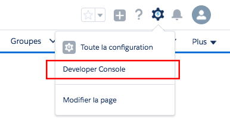

[&lt; Retour au sommaire](../README.md)

# Création et modification de composants Lightning (~ 25 min)
[Lien Trailhead](https://trailhead.salesforce.com/fr/modules/lex_dev_lc_basics/units/lex_dev_lc_basics_create)

## Objectifs de formation
Une fois cette unité terminée, vous pourrez :
- Créer et modifier des composants Lightning via la Developer Console.
- Créer une application pour tester vos composants en cours de développement.
- Développer et prévisualiser vos composants.
- Lister les différentes ressources qui composent un composant Lightning.

## Création et modification de composants Lightning
La première étape pour coder un composant Lightning, c’est de se préparer à coder. Heureusement, c’est très simple. Dans votre organisation DE, ouvrez la Developer Console sous votre nom ou dans le menu d’accès rapide ().

Voilà, vous êtes prêt à coder des composants Lightning !

## Défi pratique
Validez votre travail automatiquement grâce au [défi Trailhead](https://trailhead.salesforce.com/fr/modules/lex_dev_lc_basics/units/lex_dev_lc_basics_create#challenge) avant de passer à l'unité suivante.

---
[Unité suivante &gt;](04.md)
