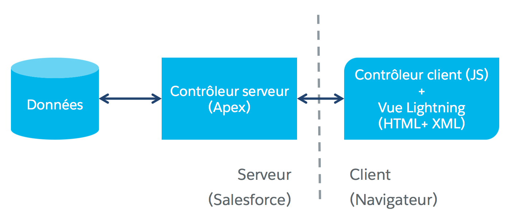

[&lt; Retour au sommaire](../README.md)

# Connexion à Salesforce avec des contrôleurs côté serveur (~ 35 min)
[Lien Trailhead](https://trailhead.salesforce.com/fr/modules/lex_dev_lc_basics/units/lex_dev_lc_basics_server)

## Objectifs de formation
Une fois cette unité terminée, vous pourrez :
- Créer des méthodes Apex qui peuvent être appelées à distance par du code de composants Lightning.
- Créer des appels de méthode à distance depuis des composants Lightning.
- Traiter des réponses du serveur de manière asynchrone avec des fonctions de rappel.
- En bonus : expliquer la différence entre `c.`, `c:` et `c.`.


## Concepts de contrôleurs côté serveur
Jusqu’ici, tout ce que nous avons fait se trouvait strictement côté client. Il est temps d’ajouter des contrôleurs côté serveur à notre application pour enrigistrer nos objets.

Pour commencer, revoyons le premier schéma étudié dans ce module, un aperçu à (très) haut niveau de l’architecture des applications à composants Lightning.



Jusqu’à présent, tout ce que nous avons étudié se trouvait côté client (et notez que nous avons simplifié les choses en fusionnant les contrôleurs et assistances). Bien que nous ayons référencé un type d’objet personnalisé `Expense__c` qui est défini côté serveur, nous n’avons jamais vraiment touché directement au serveur.

Vous vous souvenez que nous avons parlé de relier les éléments ensemble pour établir un circuit complet ? Le formulaire expenses que nous avons conçu lors de la dernière unité pourrait ressembler à ce qui suit :


Le circuit commence par le bouton **Créer** qui est relié au gestionnaire d’actions `clickCreate` (1). Lorsque ce gestionnaire d’actions s’exécute, il extrait les valeurs des champs de formulaire (2) puis ajoute une nouvelle dépense au tableau `expenses` (3). Lorsque le tableau est mis à jour via `set`, le nouveau rendu automatique de la liste des dépenses se déclenche (4).

Bon, lorsque nous câblons notre circuit pour l’accès côté serveur, le schéma devient un peu plus compliqué. Plus de flèches, plus de couleurs, plus de numéros (nous vous expliquerons tout cela plus tard) !

Lorsque nous ajoutons à cela l’accès côté serveur, le schéma devient un peu plus compliqué.


Ce circuit ne permet pas la même démarche de contrôle régulière et synchrone car les appels serveur sont coûteux en termes de ressources et de temps.

La solution pour que nos applications restent réactives tout en attendant ces réponses serveur consiste à les gérer de manière asynchrone. Cela signifie que lorsque vous cliquez sur le bouton « Créer dépense » (1), votre contrôleur côté client envoie une requête au serveur (4) en spécifiant une fonction nommée "callback" (3) puis continue le traitement (2). Non seulement il n’attend pas le serveur, mais oublie même qu’il a émis la requête !

Donc, lorsque la réponse du serveur revient (5), la fonction de callback s’exécute et la gère (6). La fonction se charge de la mise à jour des données côté client et de l’interface utilisateur.

Si vous êtes programmeur JavaScript expérimenté, l’exécution asynchrone et les fonctions de rappel font probablement partie de vos bases.


## Requête d’obtention de données Salesforce
Nous allons commencer par lire des données de Salesforce, ce qui nous permettra de charger la liste des dépenses existantes au démarrage de l’application Expenses.

**Note :** Si vous n’avez pas encore créé d'enregistrements de dépenses dans Salesforce, c’est le bon moment pour le faire. Sinon, une fois que vous aurez implémenté ce qui suit, vous pourriez vous retrouver à perdre du temps en vous demandant pourquoi rien ne se charge, alors que c’est en fait parce qu’il n’y a rien à charger.

La première étape consiste à créer votre contrôleur Apex. Les contrôleurs Apex contiennent des méthodes distantes que vos composants Lightning peuvent appeler. Dans ce cas précis, pour interroger Salesforce afin de recevoir les données des dépenses.

Examinons une version simplifiée du code. Sur la Developer Console, créez une nouvelle classe Apex nommée `ExpensesController` et collez-y le code suivant.
```java
public with sharing class ExpensesController {

    @AuraEnabled
    public static List<Expense__c> getExpenses() {
        return [SELECT Id, Name, Amount__c, Client__c, Date__c, Reimbursed__c, CreatedDate 
                FROM Expense__c];
    }
}
```

Nous aborderons les contrôleurs Apex de manière plus détaillée dans la prochaine section, mais pour le moment, la méthode Apex est vraiment très directe. Elle exécute une requête SOQL et retourne les résultats. Seuls deux éléments spécifiques rendent cette méthode accessible au code de vos composants Lightning.

- L’annotation `@AuraEnabled` figurant avant la déclaration de la méthode.
- Le mot clé `static`. Toutes les méthodes `@AuraEnabled` doivent être statiques, avec un scope `public` ou `global`.

« Aura » est le nom de l’infrastructure open source au cœur des composants Lightning. Vous avez pu observer son utilisation dans l’espace de noms pour certaines balises fondamentales, tells que `<aura:component>`. Vous savez maintenant d’où elle vient.

Point qui mérite d’être signalé : la méthode n’effectue aucune opération particulière pour empaqueter les données pour les composants Lightning. Elle se contente de retourner directement les résultats de la requête SOQL. L’infrastructure des composants Lightning gère tous les rassemblements / séparations impliqués dans la plupart des situations.


## Chargement des données de Salesforce
La prochaine étape consiste à relier le composant expenses au contrôleur Apex côté serveur. C’est si simple que vous risquez de sauter de joie. Modifiez la balise d’ouverture `<aura:component>` du composant expenses afin qu’elle pointe vers le contrôleur Apex, de la manière suivante :

```xml
<aura:component controller="ExpensesController">
```

Ce n’est pas le simple fait de pointer vers le contrôleur Apex qui charge les données ou appelle la méthode distante. Tout comme l’autoconnexion entre le composant et le contrôleur côté client, ce pointage permet simplement à ces deux éléments de « se connaître ». Cette « connaissance mutuelle » prend la même forme, un autre fournisseur de valeurs, que nous aborderons dans un moment. Mais l’autoconnexion s’arrête là.

Il nous faut encore nous assurer que :

1. nous somme capable de déclencher un traiment lorsque notre application (le composant `expenses`) est chargée
2. nous interrogeons Salesforce pour obtenir les enregistrements de dépenses existants
3. nous ajoutons ces enregistrements à l’attribut de composant `expenses`.

Nous traiterons ces opérations l’une après l’autre. Pour le premier élément, qui déclenche un comportement lorsque le composant `expenses` est chargé pour la première fois, il est nécessaire que nous développions un gestionnaire `init`. Il s’agit d’un gestionnaire d’actions relié à l’événement `init` d’un composant, qui se déclenche lorsque le composant est chargé pour la première fois.

Une seule ligne de balisage vous suffira pour cette liaison. Ajoutez ce qui suit au composant `expenses`, immédiatement en dessous des définitions d’attributs.

```xml
<aura:handler name="init" action="{!c.doInit}" value="{!this}"/>
```

La balise `<aura:handler>` indique qu’un composant peut gérer un événement spécifique. Dans notre cas, nous proposons de gérer l’événement `init` avec le gestionnaire d’actions `doInit` de notre contrôleur (la définition de `value="{!this}"` marque `this` comme étant un « événement de valeur ». La signification est trop complexe pour être abordée ici. Notez que vous devez toujours attribuer cette paire attribut-valeur à un événement `init`).


## Appel des méthodes du contrôleur côté serveur
Une étape terminée, plus que deux. Les deux étapes suivantes ont lieu dans le gestionnaire d’action `doInit`, donc c’est à lui que nous nous intéressons maintenant. Ajoutez le code suivant au contrôleur du composant `expenses`.

```js
// Load expenses from Salesforce
doInit: function(component, event, helper) {

    // Create the action
    var action = component.get("c.getExpenses");

    // Add callback behavior for when response is received
    action.setCallback(this, function(response) {
        var state = response.getState();
        if (component.isValid() && state === "SUCCESS") {
            component.set("v.expenses", response.getReturnValue());
        }
        else {
            console.log("Failed with state: " + state);
        }
    });

    // Send action off to be executed
    $A.enqueueAction(action);
},
```

Voici un aperçu de l’effet de ce nouveau gestionnaire d’action :

1. Création d’un appel de méthode à distance.
2. Configuration de ce qui se passera au renvoi de l’appel de méthode à distance.
3. Mise en file d’attente de l’appel de méthode à distance.

Observons maintenant la première ligne de code de la fonction.

```js
var action = component.get("c.getExpenses");
```

Cette ligne de code crée notre appel de méthode à distance, ou action à distance. À première vue, `component.get()` semble familier. Nous l’avons déjà fait souvent.

Sauf qu’avant... nous obtenions `v.quelqueChose`, `v` étant le fournisseur de valeur de la vue. Ici c’est `c`, et oui, `c` est un autre fournisseur de valeur. Nous avons déjà vu un fournisseur de valeur `c`, dans les expressions comme `press="{!c.clickCreateExpense}"` et `action="{!c.doInit}"`.

Ces expressions étaient situées dans le balisage du composant, dans la vue. Ici, dans le contrôleur, le fournisseur de valeur `c` représente quelque chose d’autre. Il représente le contrôleur Apex distant.

« Attendez une minute. Est-ce que vous êtes en train de me dire qu’il y a le contrôleur côté client `c`, l’espace de noms par défaut `c`, et le contrôleur côté serveur `c`, tous dans les composants Lightning ? »

En un mot, oui. Respirez profondément.

Voici un tableau récapitulatif qui devrait vous permettre de vous y retrouver :

Identifiant | Contexte | Signification
--- | --- | --- 
c. | Balisage composant | Contrôleur côté client
c. | Code contrôleur | Contrôleur côté serveur
c: | Balisage composant | Espace de noms par défaut

OK, revenons-en à notre code. Avant de nous laisser distraire, nous en étions à cette ligne.

```js
var action = component.get("c.getExpenses");
```

Dans le code que nous avions vu auparavant, `component.get("v.quelqueChose")` nous renvoyait une référence à un composant enfant de la vue (balisage composant). Ici, `component.get("c.peuImporte")` renvoie une référence à une action disponible dans contrôleur côté serveur. Dans notre cas, il renvoie un appel de méthode à distance à notre contrôleur Apex. Voici comment créer un appel à une méthode `@AuraEnabled`.

La « ligne » suivante, `action.setCallback(…)`, est un bloc de code qui sera exécuté quand l’appel de méthode à distance sera retourné. Puisque ce sera exécuté « plus tard », laissons-le de côté pour l’instant.

La prochaine ligne à être immédiatement exécutée est celle-ci.

```js
$A.enqueueAction(action);
```

Nous avons brièvement rencontré `$A` auparavant sans prendre le temps d’en parler. C’est une variable globale de l’infrastructure qui offre de nombreux services et fonctions importants. `$A.enqueueAction(action)` ajoute l’appel au serveur que nous venons de configurer à la file d’attente des requêtes de du framework Lightning. Elle sera envoyée au serveur au cours du prochain cycle de requête.

Voici ce que vous devez savoir à propos de l'appel `$A.enqueueAction(action)` dans l'immédiat :

- Il place les requêtes serveur en file d’attente.
- Il ne garranti pas de retour du serveur.


## Appels serveur, exécution asynchrone et fonctions callback
Examinons notre gestionnaire d’actions en pseudo-code.

```js
doInit: function(component, event, helper) {
    // Load expenses from Salesforce
    var action = component.get("c.getExpenses");
    action.setCallback(
        // Here’s my number,
        // Call me maybe
    );
    $A.enqueueAction(action);
},
```

Nous allons nous pencher sur les paramètres de `action.setCallback()` de manière plus détaillée. Dans le véritable code du gestionnaire d’actions, nous l’appelons ainsi :

```js
action.setCallback(this, function(response) { ... });
```

`this` est le scope dans lequel la fonction callback s’exécutera. Ici, `this` est la fonction du gestionnaire d’actions en elle-même et la fonction est ce qui est appelé lorsque la réponse du serveur est retournée.
Nous avons donc :

```js
action.setCallback(scope, callbackFunction);
```

Cela a globalement pour effet de créer la requête, d’encapsuler le code de manière à ce qu’il fasse ce qu’il a à faire une fois la demande exécutée et de l’envoyer pour exécution. À ce stade, l’exécution du gestionnaire d’actions en lui-même s’arrête.


## Défi pratique
Reprenons notre application de gestion de materiel de camping.
Nous allons créer un formulaire d'ajout de matériel avec le style SLDS.

Modifiez `campingList`:
- Placez le titre H1 dans une balise avec une classe `slds-page-header`.
- Ajoutez un composant formulaire similaire à l’exemple.
- Ajoutez un attribut `items` de type liste de `Camping_Item__c`.
- Ajoutez un attribut `newItem` de type `Camping_Item__c` avec une quantité et un prix de 0 par défaut.
- Le composant affichera les valeurs des attributs `Name`, `Quantity`, `Price` et `Packed` de l’objet `newItem` dans des champs de saisie appropriés.
- Le contrôleur JavaScript s’assurera que les valeurs des attributs ne sont pas null.
- Si le formulaire est valide, le contrôleur ajoutera `newItem` à la liste `items` et réinitialisera l’objet `newItem` aux valeurs par défaut.

Validez votre travail automatiquement grâce au [défi Trailhead](https://trailhead.salesforce.com/fr/modules/lex_dev_lc_basics/units/lex_dev_lc_basics_server#challenge) avant de passer à l'unité suivante.

**Note :** pour les besoins de la validation automatique, veillez à utiliser le contrôleur et à ne pas placer de code dans l'assistant (helper).

---
[Unité suivante &gt;](08.md)
